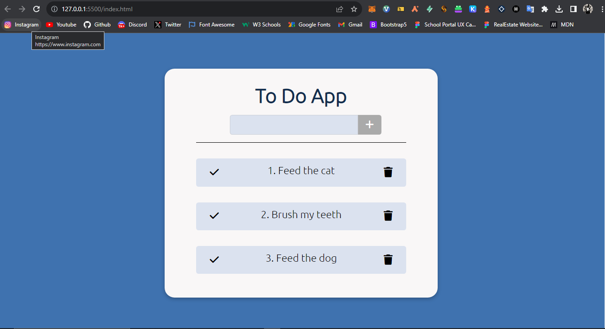

# my-todo-list

A Todo App Made With HTML, CSS & Javascript

The webapp is a simple todo list that:
a. Add Todos
b. Checks completed Todos
c. Deletes Todos
d. Saves the Todos in the local storage
e. Deletes Todos from local storage
f. Gets back the Todos from local storage....

Here's the hosted site: https://hallowdread.github.io/todo-list-app/

You can clone the website or download the zip file....
